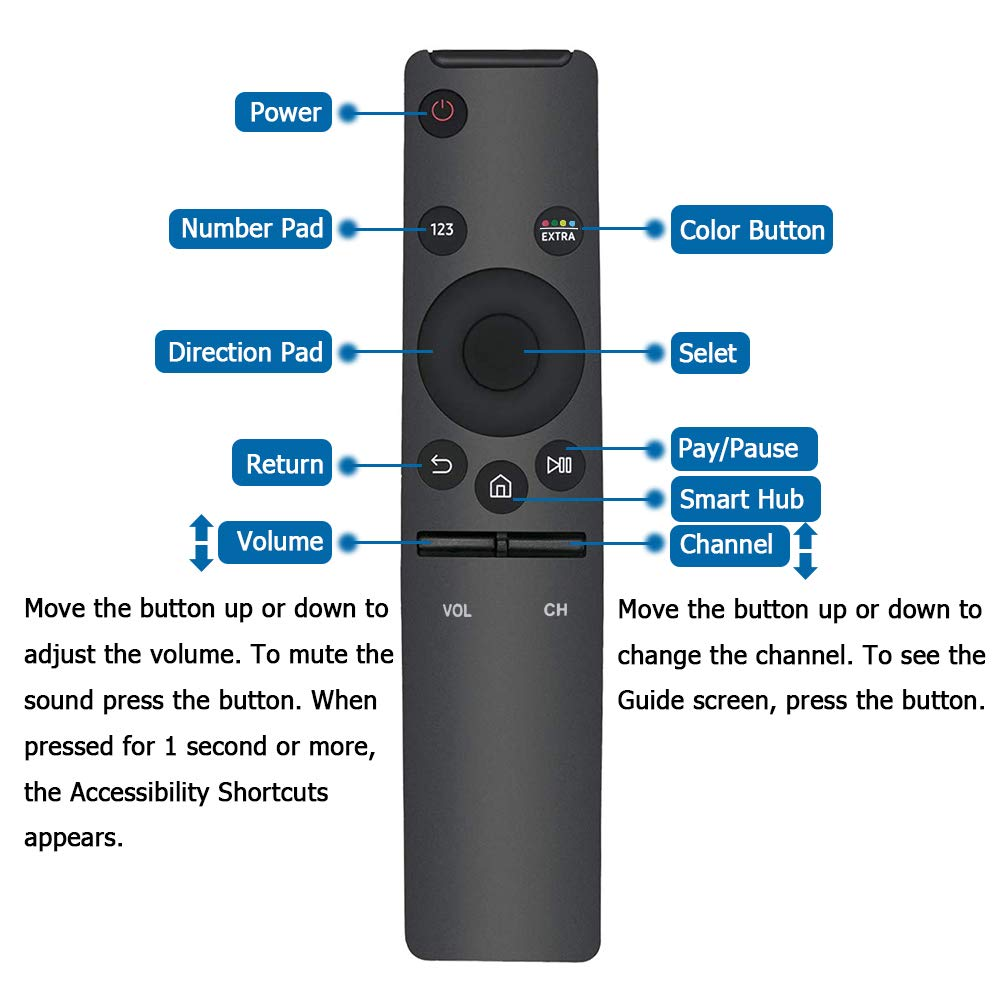

## Quick Guide

- Two remotes are used 
    1. Samsung TV Remote: Used for general TV functions and soundbar
    2. Apple TV Remote: Used for Apple TV functions
- The Samsung remote and be finicky and may need to be pointed directly at the TV in order to work properly.

## Samsung TV Remote

